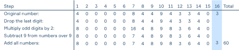

# Simple Banking System
In this project, we will develop a simple credit card banking system with a SQLite database.  
Let's take a look at the anatomy of a credit card: (e.g. 5304 4642 1234 5678)  
1. The very first number is the ***Major industry Identifier (MII)***, which tells you what a sort of institution issued the card.
    * 1 and 2 are issued by airlines
    * 3 is issued by travel and entertainment
    * 4 and 5 are issued by banking and financial institutions
    * 6 is issued by petroleum companies
    * 8 is issued by telecommunications companies
    * 9 is issued by national assignment.  
      In our banking system, credit cards should begin with 4.
2. The first six digits are the ***Issuer Identification Number (IIN)***. These can be used to look up where the card originated from.  
   In our banking system, the IIN must be 400000
3. From the 7th to the second-to-last digit is the ***customer account number***.  
In our banking system, the customer account number can be any, but it should be unique. And the whole card should be 16-digit length.
4. The very last digit of a credit card is the ***check digit*** or ***checksum***. It is used to validate the credit card number using the *Luhn algorithm*  
Here is how it works for a credit card with the number 4000008449433403:

If the received number is divisible by 10 with the remainder equal to zero, then this number is valid; otherwise, the card number is not valid.

## Objectives
Once the program starts, you should print the menu:
1. Create an account
2. Log into account
3. Exit

If the customer chooses 'Create an account', you should generate a new card number which satisfies all the conditions described above.
Then you should generate a PIN code that belongs to the generated card number. A pin code is a sequence of 4 digits. PIN should be generated in range from 0000 to 9999.
If the customer chooses 'Log into account', you should ask them to enter their card information and show the  menu:
1. Balance
2. Add income
3. Do transfer
4. Log out
5. Exit
